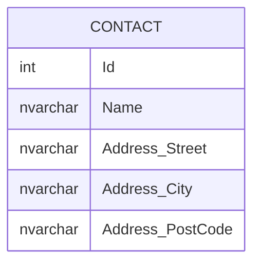

# Complex Types

Prior to EF Core 8, we had 'Owned Entities'.  These were similar to complex types but were implemented as entities under the hood which had a PK that you could not see.  This resulted in some limitations.

Complex Types are the next iteration of Owned Entities, but function much more like how we would expect them to (especially when it comes to value objects).

## Entity

```cs
public class Contact
{
    public int Id { get; set; }
    public required string Name { get; set; }
    public required Address Address { get; set; }
}

public class Address
{
    public required string Street { get; set; }
    public required string City { get; set; }
    public required string PostCode { get; set; }
}
```

## Database



## Use Cases

- Using value objects in DDD
- Breaking up large entities into smaller, more logical chunks
- Avoids some of the limitations of Owned Entities:
  - Can be either a value type of
  - Can be shard by multiple properties

## Resources

- [EF Core Docs | value-objects-using-complex-types](https://learn.microsoft.com/en-us/ef/core/what-is-new/ef-core-8.0/whatsnew#value-objects-using-complex-types)
