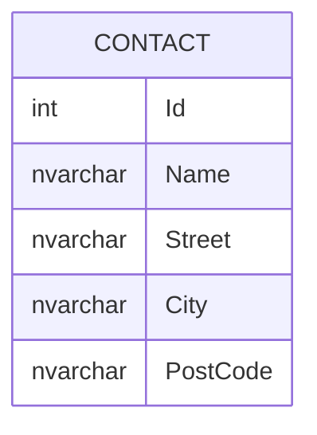

# Owned Entities

Owned Entities allow you to use nested CLR types in your entities.  These can either map to the same table as the parent or to a separate table.

## Entity

```cs
public class Contact
{
    public int Id { get; set; }
    public required string Name { get; set; }
    public required Address Address { get; set; }
}

public class Address
{
    public required string Street { get; set; }
    public required string City { get; set; }
    public required string PostCode { get; set; }
}
```

## Database



## Use Cases

- Using value objects in DDD
- Breaking up large entities into smaller, more logical chunks

## Resources

- https://learn.microsoft.com/en-us/ef/core/modeling/owned-entities