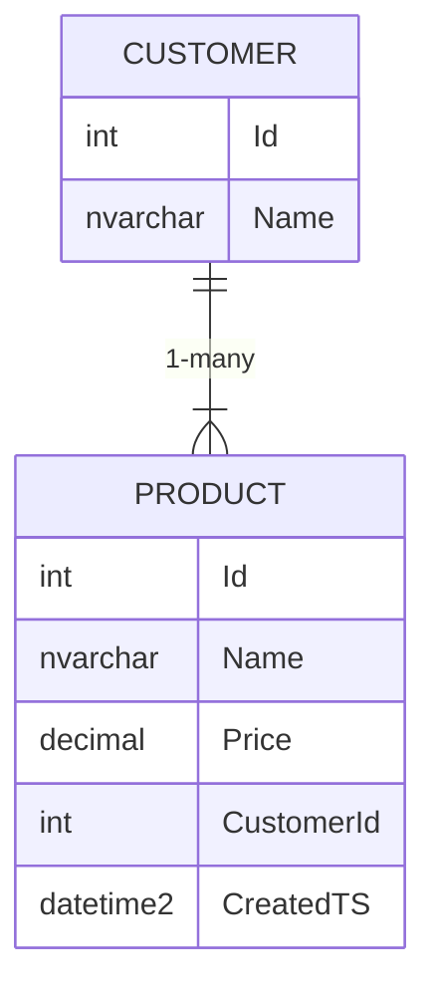

# Shadown Properties

Create fields that exist in the DB, but not in your entity model

## Model

```cs
public class Product
{
    public int Id { get; set; }
    public required string Name { get; set; }
    public decimal Price { get; set; }

    // As there is no FK, this will create a shadow property for the relationship
    public Customer Customer { get; set; }
}

public class Customer
{
    public int Id { get; set; }
    public required string Name { get; set; }
}
```

## Database

Notice the extra field `CreatedTS` and the FK `CustomerId` that is not in the model



## Use Cases

- Create DB-only fields that you do not want to expose to your entity model
- Create FK fields that you do not want to expose to your entity model

## Resources

- [EF Core Docs | Shadow Properties](https://learn.microsoft.com/en-us/ef/core/modeling/shadow-properties)

