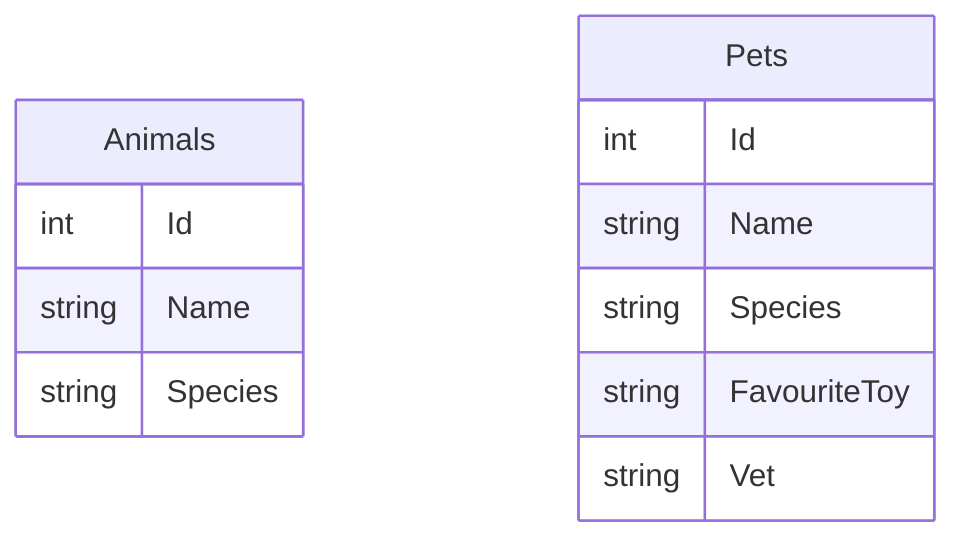
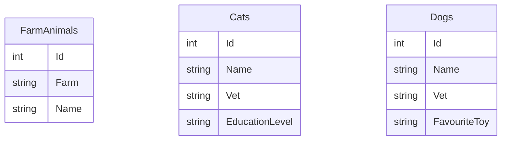

# Table Per Concrete Type

## Simple DB Example

In the simple example, we have two entities:  `Animal` and `Pet` and each maps to a table in the DB.

Data is denormalized so each table contains the union of all properties for all types in the hierarchy.

## Complex DB Example

In the complex example, we have five entities: `Animal`, `Pet`, `FarmAnimal`, `Cat`, and `Dog`.  These map to three tables in the DB (one for each concrete class).

Data is denormalized so each table contains the union of all properties for all types in the hierarchy.

## Guidance

TPC provides similar control to TPT but with additional performance benefits.  It is recommended that you use TPC over TPT.
