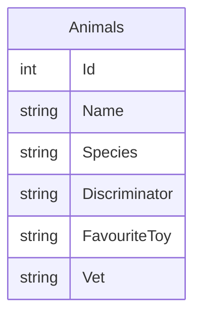
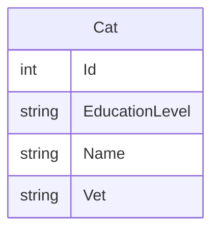
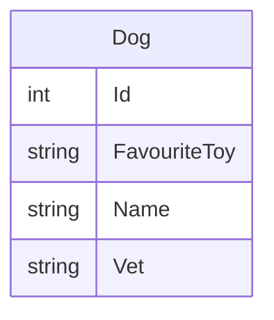
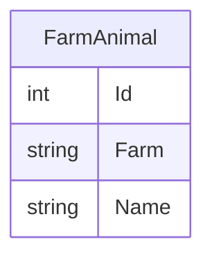

# Table Per Hierarchy

TPH is the default inheritance strategy for EF Core. 

## Simple DB Example

In the simple example we have two entities:  `Animal` and `Pet`.  However, in the DB we have only a single table with the union of fields between both.  The `Discriminator` field tells EF which row maps to which data type.

Both `Animal` and `Pet` are concrete types, which means we can use one table to represent both.

## Complex DB Example

In the complex example we have five entities: `Animal`, `Pet`, `FarmAnimal`, `Cat`, and `Dog`.  However, these only map to three tables in the DB.

`Animal` and `Pet` are both abstract classes, which means they are combined with the tables that inherit from them.

## Guidance

TPH is usually fine for most applications and is a good default for a wide range of scenarios.
