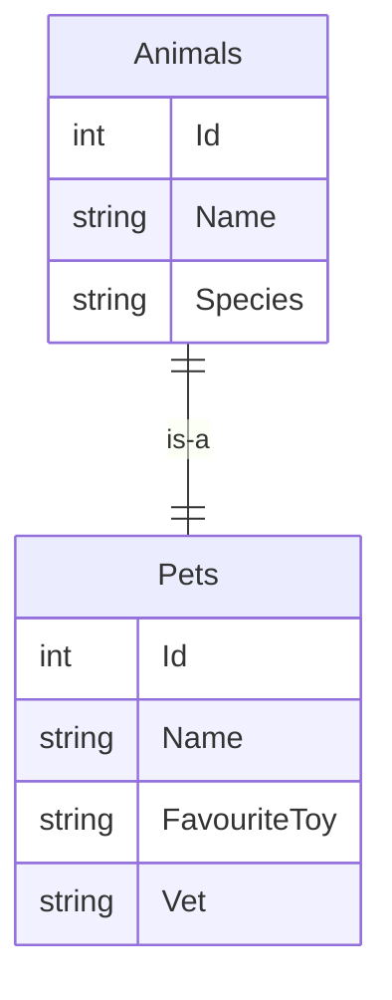
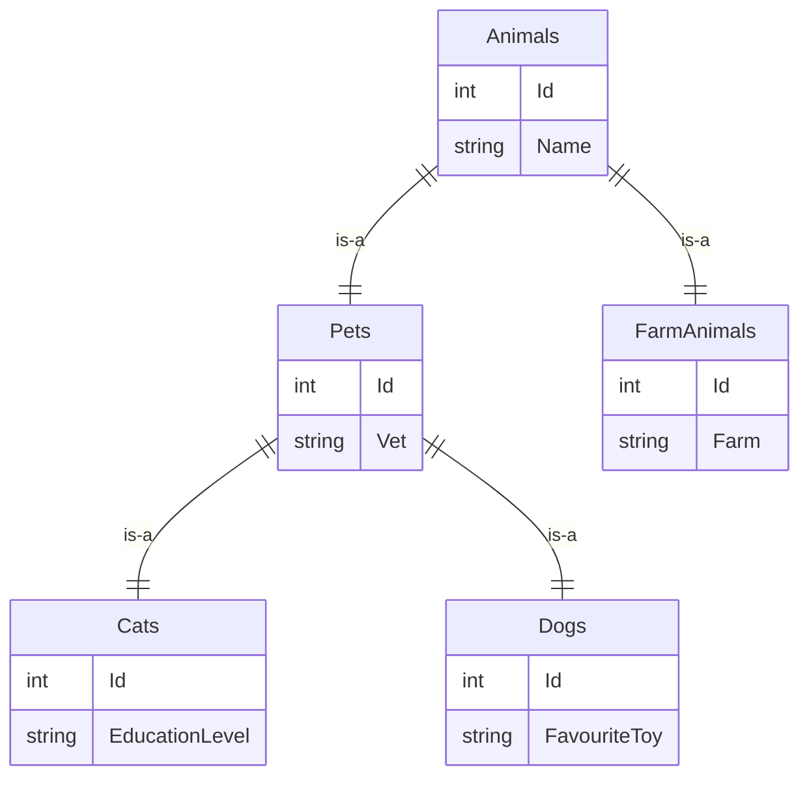

# Table Per Type

## Simple DB Example

In the simple example, we have two entities:  `Animal` and `Pet` and each maps to a table in the DB.

Note that `Pet.Id` is both a PK and FK to `Animal`

## Complex DB Example

In the complex example, we have five entities: `Animal`, `Pet`, `FarmAnimal`, `Cat`, and `Dog`, each of which maps to a table in the DB.

## Guidance

TPT is not recommended unless you are constrained by external factors.

## Resources

- https://learn.microsoft.com/en-us/ef/core/modeling/inheritance#table-per-type-configuration
