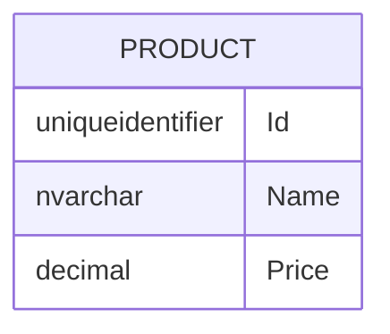

# Value Converters

Value Converters let you map from a DB type to a different CLR type.  

## Entity

```cs
public class Product
{
    public required ProductId Id { get; set; }
    public required string Name { get; set; }
    public decimal Price { get; set; }
}

public record ProductId(Guid Value);
```

## Database



## Use Cases

- Mapping encrypted DB columns to decrypted CLR properties
- Mapping simple properties to complex CLR types (e.g. Strongly Typed IDs)
- Mapping Enum values to/from strings in the DB
